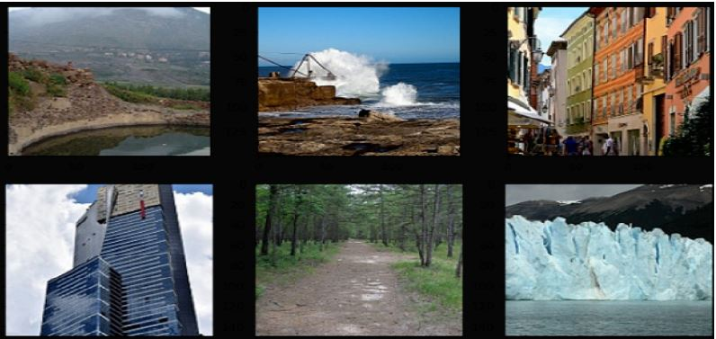
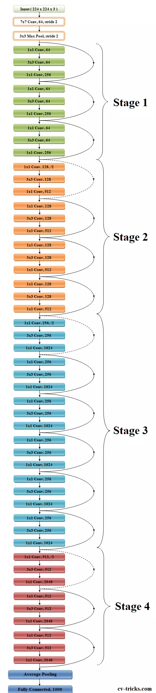
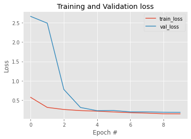

# CS867-Assignment-03
##  Classification Using CNN
Computer Vision has become ubiquitous in our society, with applications in search, image understanding, apps, mapping, medicine, drones, and self-driving cars. Core to many of these applications are visual recognition tasks such as image classification, localization and detection. Recent developments in neural network ( “deep learning”) approaches have greatly advanced the performance of these state-of-the-art visual recognition systems. This Assignment is a deep dive into details of the deep learning ResNet50 architecture with a focus on learning using Transfer learning for image classification.
This assignment is classification problem which is solved ResNet50 architecture of CNN.
### Dataset
This is the Data of Natural Scenes around the world.
This Data contains around 25k images of size 150x150 distributed under 6 categories
i.e. Buildings, Forest, Glacier , Mountain, Sea and Street.
The Train, Test and Prediction data is separated in each zip files. There are around 14k images in
Train, 3k in Test and 7k in Prediction.
You are supposed to work in following manner:
• Training set = 14k+ 150x150 Images in seg_train folder for training spread.
• Validation set = 3k+ 150x150 Images in seg_test folder for cross-validation spread.
• Test set = 7k+ 150x150 Images in seg_pred folder as test spread.

Google drive link for data set is given below
(https://drive.google.com/drive/u/1/folders/1sFv45c9C8kzYxgn0HrFd9OBJnGrjoHj0)

#### ResNet
ResNet was proposed by He et al., which is considered as a continuation of deep networks (He et al. 2015a). ResNet revolutionized the CNN architectural race by introducing the concept of residual learning in CNNs and devised an efficient methodology for the training of deep networks. Similar to Highway Networks, it is also placed under the Multi-Path based CNNs; thus, its learning methodology is discussed in Section 4.3.2. ResNet proposed 152-layers deep CNN, which won the 2015-ILSVRC competition. The architecture of the residual block of ResNet is shown in Fig. 7. ResNet, which was 20 and 8 times deeper than AlexNet and VGG, respectively, showed less computational complexity than previously proposed networks (Krizhevsky et al. 2012; Simonyan and Zisserman 2015). He et al. empirically showed that ResNet with 50/101/152 layers has less error on image classification task than 34 layers plain Net. Moreover, ResNet gained a 28% improvement on the famous image recognition benchmark dataset named COCO (Lin et al. 2014). Good performance of ResNet on image recognition and localization tasks showed that representational depth is of central importance for many visual recognition tasks.

##### Model Training and Validation graphs
A pre-trained ResNet50 model is taken from Keras applications excluding top layers. Top layers are added addtionally to trained it on given data set. Trained Data is processed through data augmentation to avoid overfiiting. The trained model is then tested on an unseen data which provides good prediction. Here are Model Training and Validation loss curves

Training and Validation Accuracy curve

Classifcation report of the new trained model

Google drive link for the trained model weights is given below
(https://drive.google.com/drive/u/1/folders/1XjKnBIbo1_IKPEkmWG68kZndB48o5v2r)
